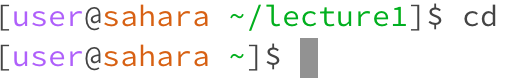
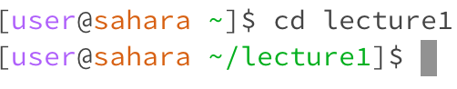
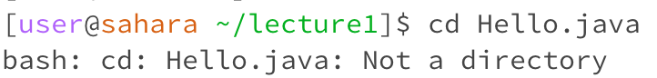
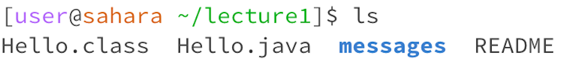
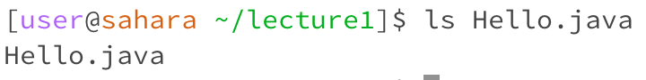
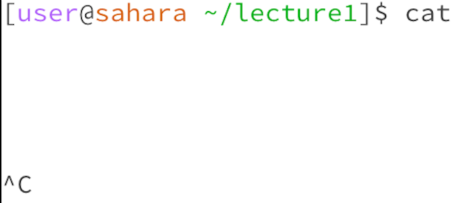
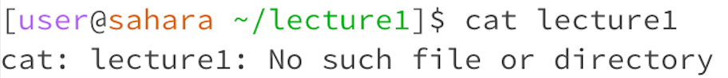
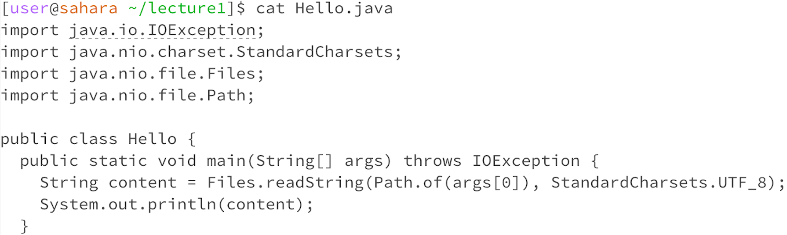

# Lab Report 1
## cd
1. 'cd' without any argument provided no output as cd is used to change the current directory to the one specified with the argument. As there is no argument provided, there will not be an output.

   
2. 'cd' with a directory as an argument changes the directory the terminal is in, allowing you to use files within that directory.
   
3. 'cd' with a file as an argument provides an error message, as 'cd' only works with directories.

## ls
1. 'ls' without an argument provides a list of the files and the messages folder within the lecture1 directory.
   
2. 'ls' with a directory as an argument creates an error message, as this command is not meant to use a directory in that way. 
   
3. 'ls' using a file as an argument provides the file's name.

## cat
1. 'cat' without an argument runs while waiting for a keyboard input. Control + c is used to return to the terminal.
    
2. 'cat' with lecture1 as an argument provides an error message, as it cannot provide 
 
3. 'cat' with a file name outputs the code within that file. 

