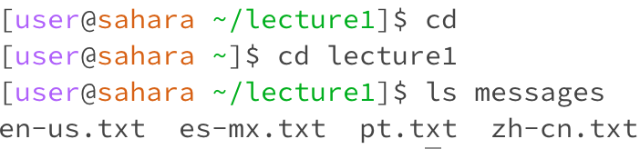
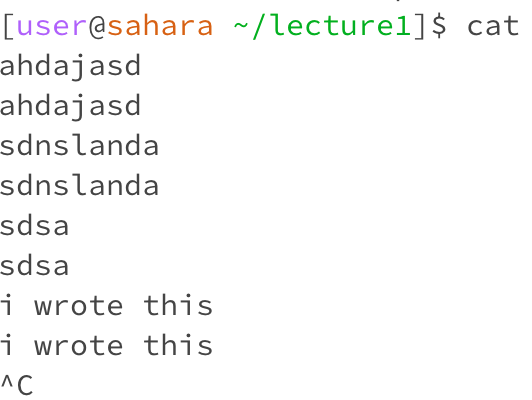

# Lab Report 1
## cd
1. **cd** without any argument provided no output as **cd** changes the current directory to the one specified with the argument. As no argument is provided, it takes you to the home directory as that is the overarching directory that contains the rest.   
   
  2. **cd** with a directory as an argument changes the directory the terminal is in, allowing you to use files within that directory.
     
  3. **cd** with a file as an argument provides an error message, as 'cd' only works with directories.

## ls
1. **ls** without an argument provides a list of the files and the messages folder within the lecture1 directory.
   
2. **ls** with a directory as an argument provides a list of all the files that are located in the specified directory, which in this case is the messages directory. 
   
3. **ls** using a file as an argument provides the file's name.

## cat
1. **cat** without an argument runs while waiting for a keyboard input. Once it gets a keyboard input and the user presses enter, it will repeat the text hat has been entered in the next line. To exit this argument space, you have to press Ctrl + C. 
    
2. **cat** with lecture1 as an argument provides an error message. This error message is caused as 'lecture1' is not a plain text readable file. 
 
3. **cat** with a file name outputs the code within that file. 

