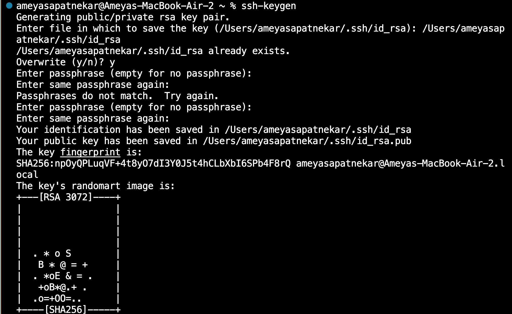

# Lab Report 2

## Part 1
 
 
For this screenshot, the handleRequest method was called, specifically the if block relating to add and "s". This method prints out the iteration of the number, as well as the given string in the query portion of the URL, in this case, **Hello**. The input is stored and gets added to as more Strings are added. 

 

In this image, we see the same method, handleRequest, being called. The same if block of code is called. In the output, we get to see that the previous input of **Hello** has been saved, and a new line has been created, where we are able to see our new input as well as the iteration it is on. 

## Part 2
**Private Key**

 

**Public Key**

 

**Passwordless Login**

 

## Part 3

Over the last two weeks, I've learned how to run a server and become better and more familiar with basic Unix commands. Learning the different parts of the URL was interesting, as before this, I did not know what any of it meant. 
