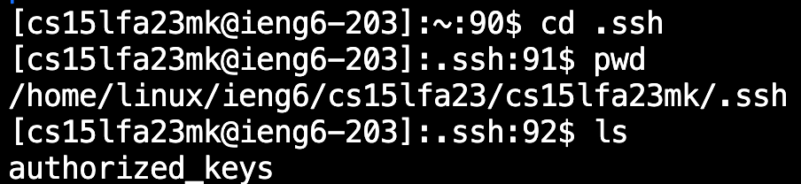
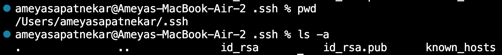

# Lab Report 2

## Part 1
 
 
For this screenshot, the handleRequest method used the given URL as the argument. The method utilizes the if statements to check if the URL contains /add. Once it checked that the URL path does contain /add, it splits the query at the "=" and then checks if the characters before the = are an "s" or "count" In this case, as it was "s" it stores the parameters after the equal sign as a new string called **newString** and then increments the number by +1. It then appends the string **newString** to the existing string called **str** which, at this time, is blank. 

 

In this image, we see the same method, handleRequest, being called with the new URL passed as the argument—the same if block of code is called. Looking at the output, we can see that the returned string **str** shows both the results from our first input, as well as our new input, as well as representing the order of them with the proper number, saved under the **num** variable.

## Part 2
**Private Key**

 

**Public Key**

 

**Passwordless Login**

 

## Part 3

Over the last two weeks, I've learned how to run a server and become better and more familiar with basic Unix commands. Learning the different parts of the URL was interesting, as before this, I did not know what any of it meant. 
