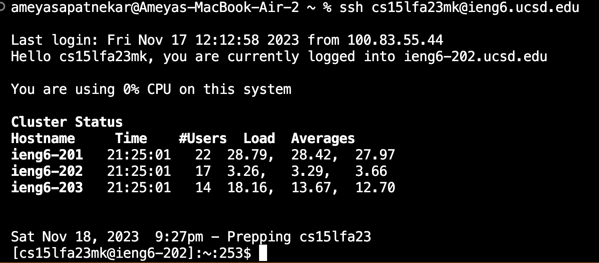
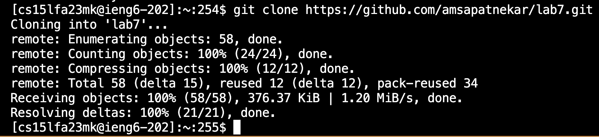
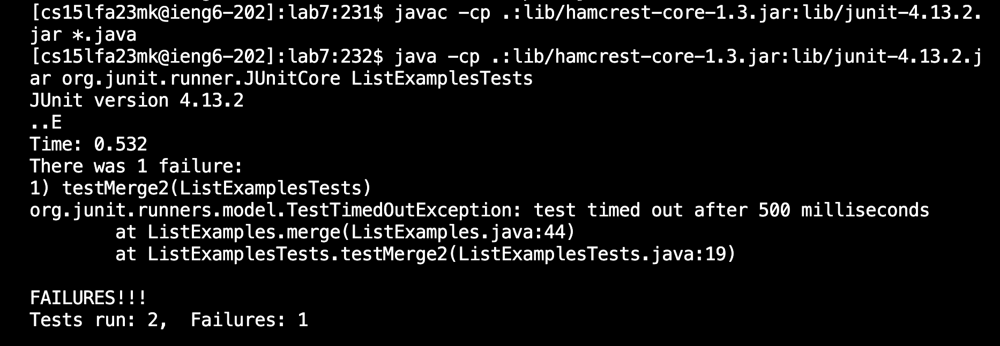
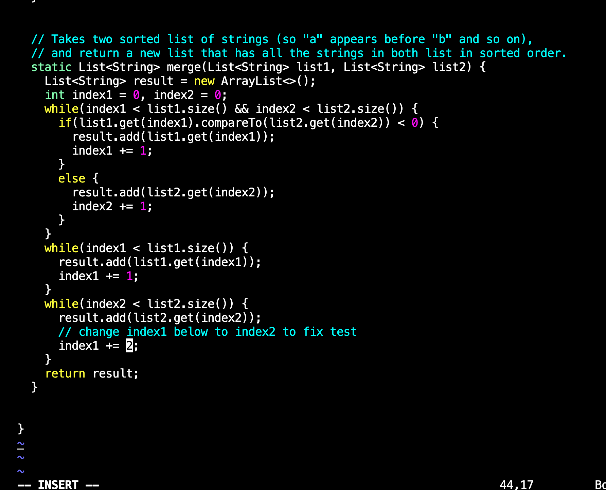
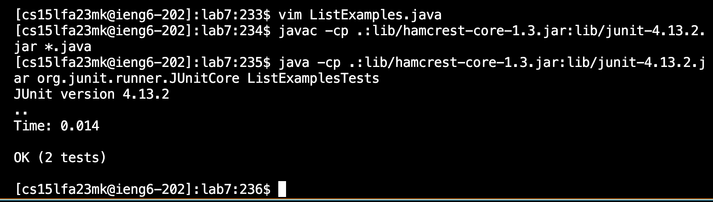
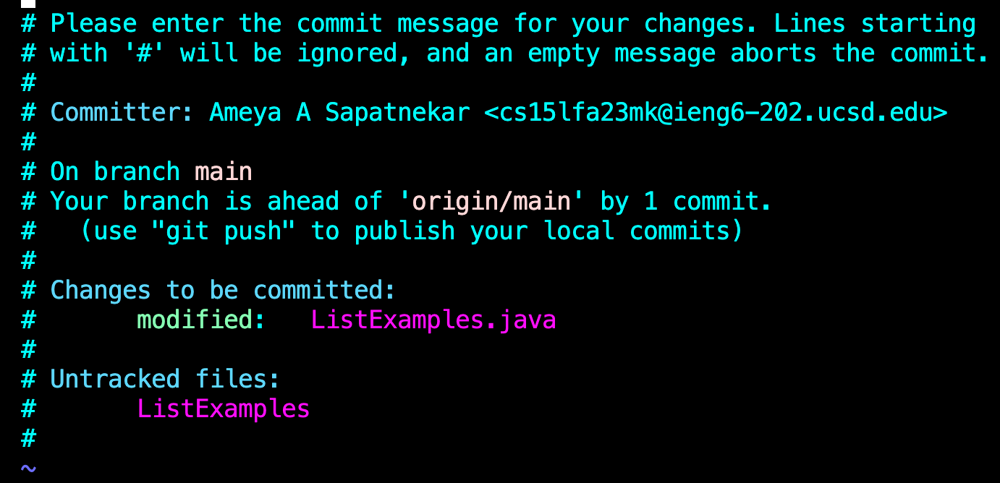

# Lab Report 4

## Step 1: Log into ien6
 
~~~~
<up><enter>
~~~~
This led me to the ssh command that was saved in my terminals history. 
## Step 2: Clone fork of repository from Github account
 
~~~~
<up><up><enter>
~~~~
Finds and runs the git clone command from my terminals history.
## Step 3: Run the tests
 
~~~~
<cd lab7/><up><up><up><up><enter>
~~~~
makes lab7 the working directory, and then goes 4 up in the terminals history to find the *javac -cp .:lib/hamcrest-core-1.3.jar:lib/junit-4.13.2.jar *.java* command. 
~~~~<up><up><up><up><up><enter>
~~~~
finds *java -cp .:lib/hamcrest-core-1.3.jar:lib/junit-4.13.2.jar org.junit.runner.JUnitCore ListExamples.java* which runs the code, showing the error codes. 
## Step 4: Edit the code
 
~~~~
<v><i><m><space><L><tab><.><j><tab><enter>
~~~~
This sequence uses the tab key to autofill the command to open the file ListExmaples.java in the VIM editor. 
~~~~
<43j><w5><l><x><i><2><esc><:wq><enter>
~~~~
This sequence aligns the cursor with the character that needs to be changed, deletes it, and then enters insert mode, where it puts the 2 in the correct position. 
## Step 5: Run the test
 
~~~~
<up><up><up><enter>
~~~~
compiles the code
~~~~
<up><up><up><enter>
~~~~
runs the code
## Step 6: Commit and push
 
~~~~
<up><up><up><up><up><up><up><up><enter>
~~~~
finds the git add command in history
~~~~
<up><up><up><up><up><up><up><enter>
~~~~
finds the git commit in history

Run the tests, demonstrating that they fail
Edit the code file to fix the failing test
Run the tests, demonstrating that they now succeed
Commit and push the resulting change to your Github account (you can pick any commit message!)
