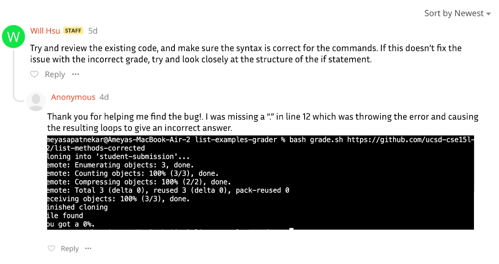
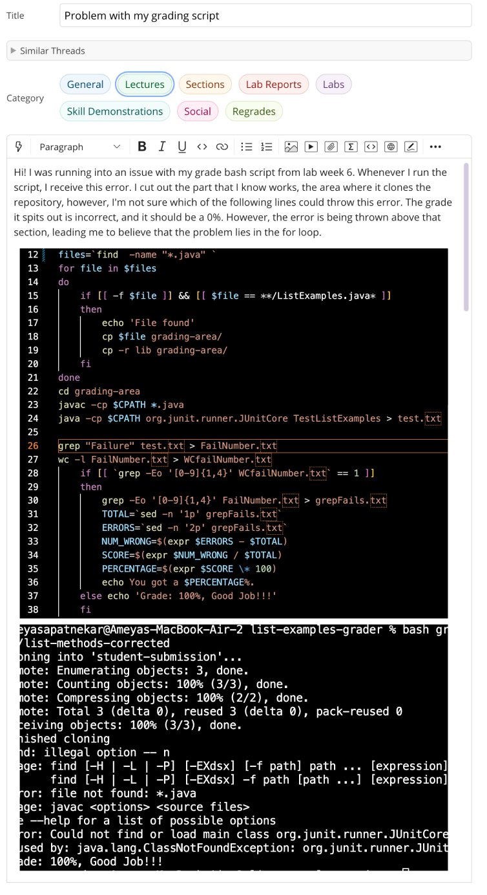

# Lab Report 5

## Part 1

 

 

## Part 2

Throughout the second half of lab this quarter I felt myself grow more familiar with bash. Doing the bash grading script with my labmates was helpful a I learnt how to use bash from my peers, but also learnt some interesting ways on solving problems, and getting the code to do whatt we wanted. In this half I also learnt how to use githuub from my terminal. Figuring out how to push and commit, as well as set it up so that I could push repositories from the ieng6 server was interesting, and gave me a look into github as I read some of the documentation for it. 
