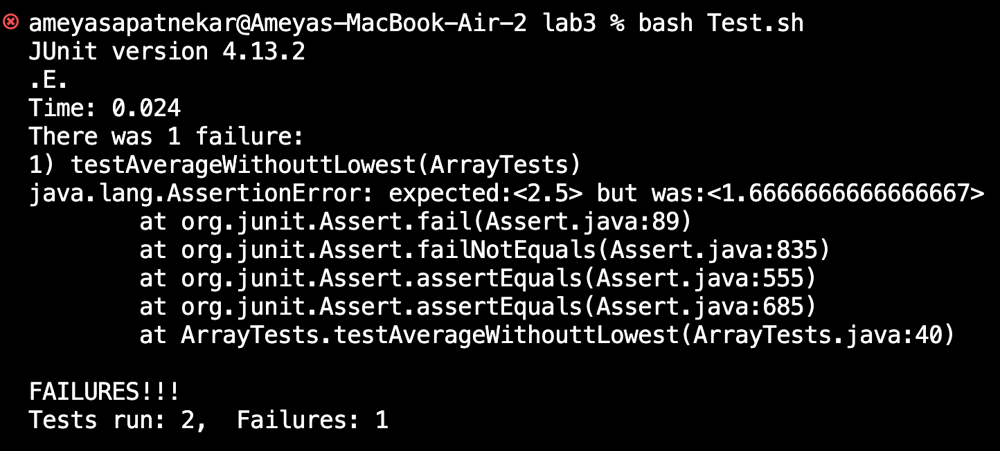

# Lab Report 3

## Part 1

**Failure inducing input**
~~~~
  @Test
  public void testAverageWithouttLowest() {
    double[] input1 = {3.0,2.0,1.0,1.0};
    double solution = 2.5;
    assertEquals(solution, ArrayExamples.averageWithoutLowest(input1),0.0001);
  }
~~~~

**Non-failure inducing input**

~~~~
@Test
  public void testAverageWithouttLowest2() {
    double[] input1 = {3.0,2.0,1.0};
    assertEquals(2.5,ArrayExamples.averageWithoutLowest(input1), 0.0001);
  }
~~~~

**Symptom**

 

**The bug**

*Before*

~~~~
  static double averageWithoutLowest(double[] arr) {
    if(arr.length < 2) { return 0.0; }
    double lowest = arr[0];
    for(double num: arr) {
      if(num < lowest) { lowest = num; }
    }
    double sum = 0;
    for(double num: arr) {
      if(num != lowest) { sum += num; }
    }
    return sum / (arr.length - 1);
  }
~~~~

*After*

~~~~
  static double averageWithoutLowest(double[] arr) {
    if(arr.length < 2) { return 0.0; }
    double lowest = arr[0];
    for(double num: arr) {
      if(num < lowest) { lowest = num; }
    }
    double sum = 0;
    int countLowest = 0;
    for(double num: arr) {
      if(num != lowest) { sum += num; }
      if(num == lowest) {countLowest+=1; }
    }
    return sum / (arr.length - countLowest);
  }

~~~~

The problem with the original code is that it needed to account for what can happen if there are more than 1 of the lowest number. By initializing a variable **countLowest**, to keep track of how many instances of the lowest double are contained in the argument, we are able to keep track of how many instances there are and then subtract that from our average calculation.   

## Part 2

I chose to look moe at the command **less**. The less command shows the contents of the file passed as an argument one screen at a time. There are various options that can be used with this command, each of which modifies the output. 

### -N

-N=provides line numbers for lines in the files, which can help identify certain statements in .txt files. However, this command will only work on files. 

*input*
~~~~
less -N pmed.0020191.txt
~~~~
*output*
~~~~
  1 
      2   
      3     
      4       
      5         
      6         The excellent article by Jordan Paradise, Lori B. Andrews, and colleagues      6 , “Ethics.
      7         Constructing Ethical Guidelines for Biohistory” [1], neither advocates no      7 r argues against
      8         biohistorical research; instead, it points out that such investigations a      8 re currently
      9         taking place without guidelines—ethical, scientific, moral, or religious.      9  The question
     10         remains: if such guidelines were to be established, what individuals, ins     10 titutions,
     11         governments, medical examiners, family members, or intrepid biographers a     11 re to be given
     12         permission? Who is to decide what is “historically significant”? Not to m     12 ention the
     13         meta-question: who is to decide who is to decide? I apologize to the auth     13 ors if my brief
     14         comments [2] implied that they took a position on this issue.
     15       
     16     
     17
~~~~

*input* 
~~~~
less -N government/About_LSC
~~~~

*output*

~~~~
About_LSC is a directory
~~~~

### -i

-i ignores the case sensitivity of the file passed as an argument. This can help try to find files. However, it can be cumbersome if there are many files with the name only differing by the case positioning. 

*input*
~~~~
less -i PMED.0020191.TXT
~~~~

*output*

~~~~

  
    
      
        
        The excellent article by Jordan Paradise, Lori B. Andrews, and colleagues, “Ethics.
        Constructing Ethical Guidelines for Biohistory” [1], neither advocates nor argues against
        biohistorical research; instead, it points out that such investigations are currently
        taking place without guidelines—ethical, scientific, moral, or religious. The question
        remains: if such guidelines were to be established, what individuals, institutions,
        governments, medical examiners, family members, or intrepid biographers are to be given
        permission? Who is to decide what is “historically significant”? Not to mention the
        meta-question: who is to decide who is to decide? I apologize to the authors if my brief
        comments [2] implied that they took a position on this issue.
      
    
  
~~~~

*input*
~~~~
less -i PLOS
~~~~

*output*
~~~~
PLOS is a directory
~~~~
Even though plos is a directory, the -i still works to ignore the case sensitivity and gives an error message about the correct directory. 

### String Search 

While on the screen for less, the user can press the **/** key, which creates a search bar to find the given string and highlights the string if it is found.

*input*
~~~~
less pmed.0020191.txt
~~~~

After pressing **/** and searching for the string "position."

*output*
~~~~
        comments [2] implied that they took a position on this issue.
      
    
  
~
~
~
~
~
~
~
~
~
~
~
~
~
~
~
~
~
~
~
~
~
~
~
~
~~~~

*input*
~~~~
less pmed.0020191.txt
~~~~

This time, I searched for the string "or" as it appears in 2 different lines in this file.

*output*
~~~~
        The excellent article by Jordan Paradise, Lori B. Andrews, and colleagues, “Ethics.
        Constructing Ethical Guidelines for Biohistory” [1], neither advocates nor argues against
        biohistorical research; instead, it points out that such investigations are currently
        taking place without guidelines—ethical, scientific, moral, or religious. The question
        remains: if such guidelines were to be established, what individuals, institutions,
        governments, medical examiners, family members, or intrepid biographers are to be given
        permission? Who is to decide what is “historically significant”? Not to mention the
        meta-question: who is to decide who is to decide? I apologize to the authors if my brief
        comments [2] implied that they took a position on this issue.
      
    
  
~
~
~
~
~
~
~
~
(END)
~~~~

*The highlights do not show up when put in markdown; however, each instance of the string *or* is highlighted on the less screen. 

### -X

The -X option will keep the content on the terminal after exiting the less screen. This can be used to refer to the results of it while also being able to input more commands.

*Input*
~~~~
ameyasapatnekar@Ameyas-MacBook-Air-2 plos % less -X pmed.0020191.txt
~~~~

*Output*
~~~~
ameyasapatnekar@Ameyas-MacBook-Air-2 plos % less -X pmed.0020191.txt

  
    
      
        
        The excellent article by Jordan Paradise, Lori B. Andrews, and colleagues, “Ethics.
        Constructing Ethical Guidelines for Biohistory” [1], neither advocates nor argues against
        biohistorical research; instead, it points out that such investigations are currently
        taking place without guidelines—ethical, scientific, moral, or religious. The question
        remains: if such guidelines were to be established, what individuals, institutions,
        governments, medical examiners, family members, or intrepid biographers are to be given
        permission? Who is to decide what is “historically significant”? Not to mention the
        meta-question: who is to decide who is to decide? I apologize to the authors if my brief
        comments [2] implied that they took a position on this issue.
      
    
  
ameyasapatnekar@Ameyas-MacBook-Air-2 plos % 
~~~~

*input*
~~~~
less -X government/Gen_Account_Office/d01121g.txt
~~~~

*output*
~~~~

United States General Accounting Office
Office of Special Investigations
GAO

ameyasapatnekar@Ameyas-MacBook-Air-2 technical % 
~~~~
